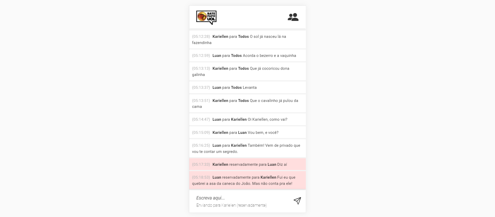

# 
# Projeto bate papo do UOL com API em Node.js
### Criado na semana 13 do bootcamp Responde Aí
## Tecnologias Utilizadas:
|HTML|CSS|JavaScript|Node.js|
|-|-|-|-|
|||||
|Estruturação das páginas|Estilização das páginas|Aplicação das funcionalidades front-end e criação da API no back-end|Criação da API e funcionalidades back-end|
___
[Clique aqui](https://uolchat.vercel.app/) para acessar o App
___

